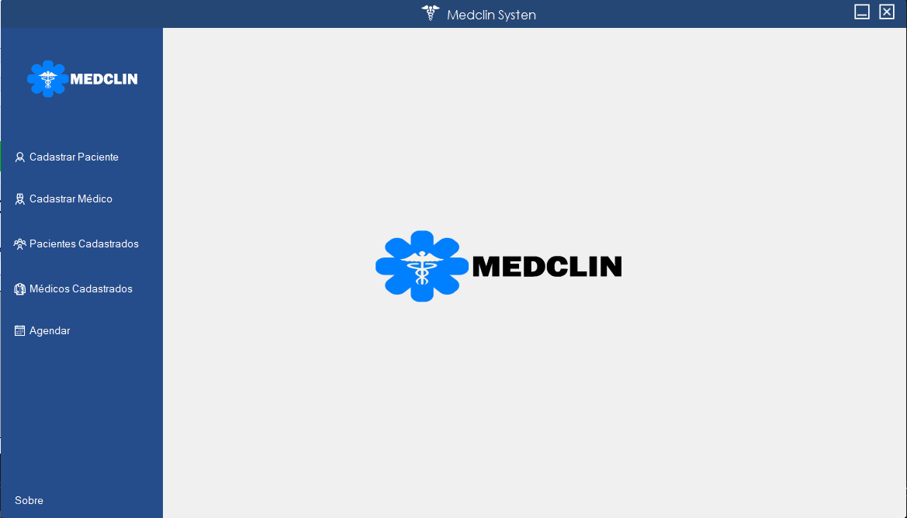
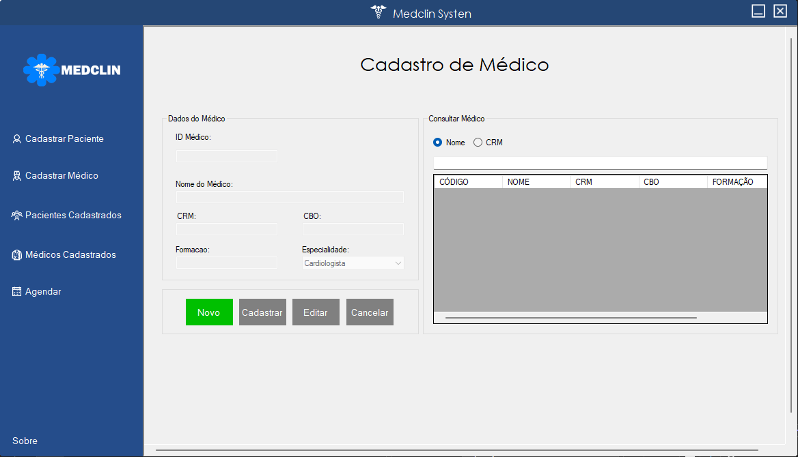
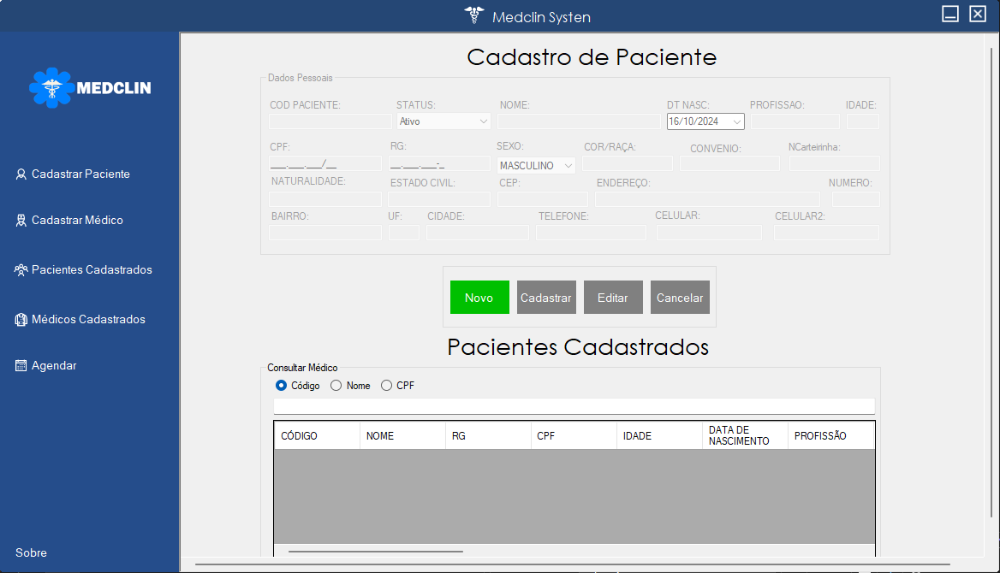
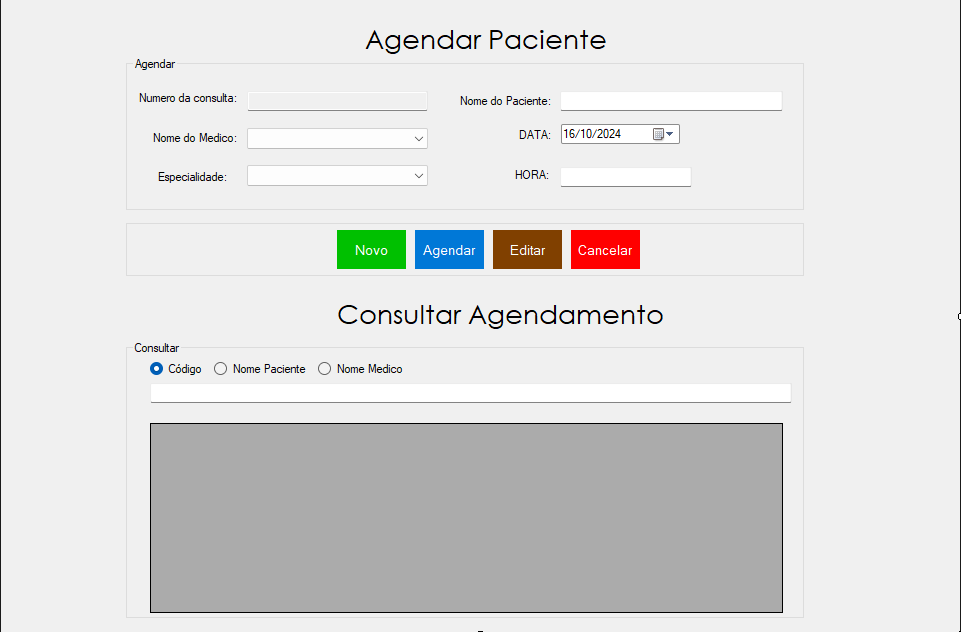

# Sistema de Agendamento de Consultas Médicas

Este é um sistema de desktop desenvolvido para gerenciar o cadastro de médicos, pacientes e agendamentos de consultas. O objetivo é facilitar a organização e o acesso a informações relevantes para o atendimento médico.

## Funcionalidades

- **Cadastro de Médicos**: Permite cadastrar médicos com informações como nome, especialidade e contato.
- **Cadastro de Pacientes**: Possibilita o registro de pacientes, incluindo dados pessoais e informações de contato.
- **Agendamento de Consultas**: Os usuários podem agendar consultas entre médicos e pacientes, visualizando disponibilidade e horários.

## Tecnologias Utilizadas

- **Linguagem**: C#
- **Banco de Dados**: MSSQL

## Screenshots






## Instalação

1. Clone o repositório:
   ```bash
   git clone https://github.com/clayton-oly/medclin.git
